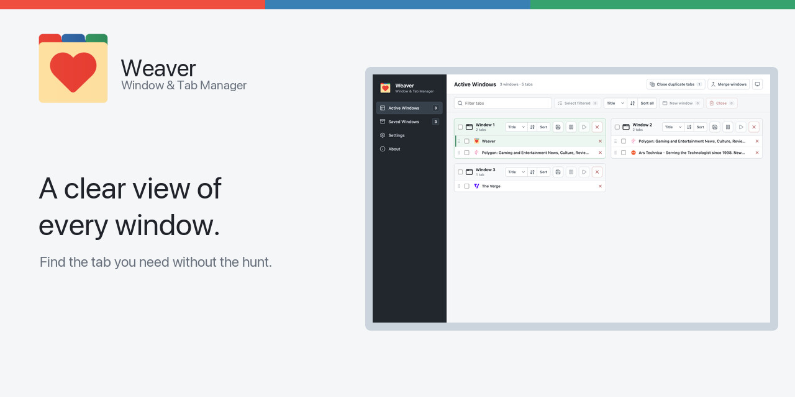

# Weaver

**Less tab chaos. More focus.**

Weaver gives you a clear view of every Chrome window, helps you find the tab you need, and lets you save a window to restore later.

## Features

- Search, sort, move, merge, suspend, restore, and close tabs across windows.
- Save named window snapshots locally and restore them later.
- Close exact duplicate URLs, with optional matching for Google Docs, Sheets, Slides, Notion, and user-defined sites.
- Preserve Chrome tab groups while organizing tabs.
- Use System, Light, or Dark appearance modes.

Advanced duplicate matching is off by default. Exact full-URL duplicate matching remains available without enabling site-specific rules.

## Privacy

Weaver has no account, analytics, or advertising. Open-tab details, preferences, custom rules, and saved-window snapshots are processed locally in Chrome and are not sent off your device. See the [privacy policy](PRIVACY.md) for the full disclosure.

## Support

Use [GitHub Issues](https://github.com/satobin/weaver-tab-manager/issues) for bug reports and feature requests. Do not include private tab titles, URLs, saved-window contents, or other browsing data in an issue. See [SUPPORT.md](SUPPORT.md) for details.

## License

Weaver is available under the [MIT License](LICENSE).
